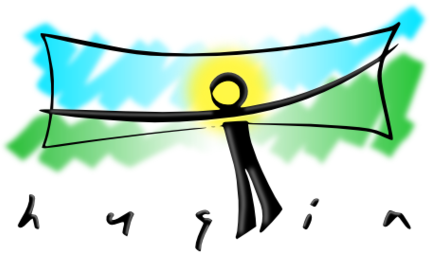

 <a href="https://wiki.panotools.org/Hugin">оригинальная документация🗗</a> | <a href="https://hugin.shikhalev.org/"><b>Hugin по-русски</b></a> | лицензия <a href="LICENSE">GNU FDL 1.3</a>

> **Hugin** (*Хугин* — один из воронов Одина в скандинавской мифологии) —
> свободная кроссплатформенная программа, базирующаяся на идеях
> доктора Хельмута Дерша (Helmut Dersch), заложенных им в набор
> бесплатных инструментов под названием Panorama Tools, и позволяющая
> не только автоматизировать процесс сшивания панорамных фотографий,
> но и вручную гибко устанавливать параметры или изменять их, что
> положительно влияет на конечный результат по сравнению с многими
> программами, обеспечивающими полностью автоматизированную сшивку.
>
> [Wikipedia🗗](https://ru.wikipedia.org/wiki/Hugin)

# Hugin по-русски

Проект перевода/переложения/пересказа документации по **[Hugin][hugin]** на русский язык. Финальная задача — получение финального 
руководства не хуже того, что имеется по-английски.

Написание ведется в `md`-файлах, которые затем собираются посредством Jekyll и тут же (в GitHub Pages) публикуются на сайт
<https://hugin.shikhalev.org/>.

## Особенности

*Во-первых*, для понимания работы с панорамами в Hugin простого описания самой программы совершенно недостаточно, потому что
сам Hugin — это графический интерфейс, за котороым стоит множество отдельных утилит, за которыми, в свою очередь спрятаны
хитрые алгоритмы, опирающиеся на значительную теоретическую основу.

И [документация, которая нас интересует][doc], описывает как это множество утилит, так и многие базовые понятия и алгоритмы.
Соответственно, и в русском варианте требуется такое *широкое* описание.

*Во-вторых*, вышеупомянутая документация существует в wiki-варианте и не всегда хорошо структурирована. Поэтому прямой перевод
выглядит не лучшим вариантом, или, правильнее сказать, недостаточным.

## TODO

- [x] Сменить вики-разметку на Markdown
- [ ] Упорядочить
  - [ ] Структурировать материал в целом
  - [ ] Вынести глоссарий на одну страницу
  - [ ] Сделать нормальную навигацию
  - [ ] Сделать систему статусов страниц и ее отражение в шаблоне
    - [ ] И систему тудушек
- [x] Перевести под управление Jekyll
  - [ ] Сделать нормальные стили, возможно взяв собственную тему
  - [ ] Картинки сделать кликабельные
- [x] Прикрутить комментарии
- [ ] favicon

[hugin]: https://wiki.panotools.org/Hugin
[doc]: https://wiki.panotools.org/Main_Page
