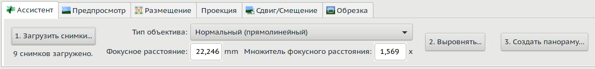
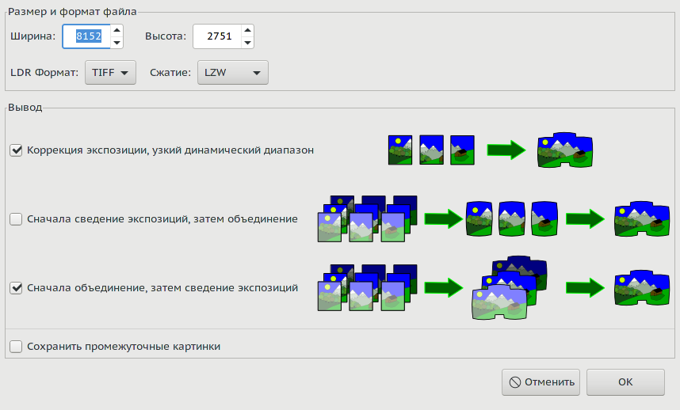
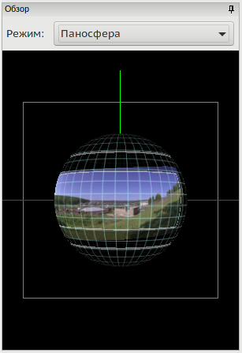

<small>[оригинал🗗](https://wiki.panotools.org/Hugin_Assistant_tab)</small>

Ассистент [[Hugin]] автоматизирует почти все, что нужно для создания панорамы; просто выполните три шага, описанных ниже. 

Снимок части верхней половины экрана:

## 1. Загрузить снимки...

Нажмите кнопку «**Загрузить снимки...**», чтобы выбрать фотографии, которые вы хотите использовать в своей панораме.

Он пытается определить [[поле зрения|Поле зрения]] ваших фотографий, просматривая информацию (EXIF), хранящуюся в самой камере. Если это не помогло, вам нужно ввести **поле зрения** вручную или позволить Hugin рассчитать его по [[фокусному расстоянию|Фокусное расстояние]] и [[множителю фокусного расстояния|Множитель фокусного расстояния]].

Также выберите соответствующий *[[тип объектива|Hugin_Photos_tab#Lens_type]]* из выпадающего списка. Если вы не уверены, попробуйте «**Нормальный (прямолинейный)**» по умолчанию.
<!-- TODO: проконтролировать ссылку -->

## 2. Выровнять...

При нажатии кнопки «Выровнять...» будет использоваться автоматический инструмент (тот, который установлен *по умолчанию* на вкладке «[[Детекторы контрольных точек]]» в настройках) для сопоставления изображений, а затем будет использован внутренний оптимизатор Hugin для выравнивания, корректировки экспозиции и баланса белого.

Предварительный просмотр результата будет отображаться в нижней половине этого экрана. Если этот предварительный результат выглядит хорошо, перейдите к третьему шагу (кнопка «**Создать панораму...**»), в противном случае вам потребуется внести некоторые изменения в изображения, настройки и оптимизации проекта на других вкладках.

## 3. Создать панораму...

Наконец, используйте «**Создать панораму...**», чтобы сшить панораму в файл изображения со стандартными настройками качества. После того, как вы нажмете кнопку «Создать панораму», появится новое диалоговое окно сшивки. Это даст вам легкий для понимания обзор вариантов.

## Настройки

[[Вкладка в диалоге настроек|Hugin_Preferences#Assistant]] (вызывается из меню из меню) позволяет вам настроить некоторые параметры помощника.
<!-- TODO: проконтролировать ссылку -->

## <a name="preview">Обзор и предварительный просмотр</a>

И обзор, и предварительный просмотр будут отображаться на всех вкладках простого интерфейса, будь то *вкладка «Ассистент»*, [[«Предпросмотр»|Вкладка «Предпросмотр»]], [[«Размещение»|Главное-окно#layout]], [[«Проекция»|Вкладка «Проекция»]], [[«Сдвиг/Смещение»|Вкладка «Сдвиг/Смещение»]] или [[«Обрезка»|Вкладка «Обрезка»]].

### Обзор

**Обзор** представляет собой интерактивный предварительный просмотр панорамы.

**Примечание:** немного выше изображения сферы вы видите раскрывающийся список режимов, текущий — «Паносфера» (по умолчанию). Это раскрывающееся меню доступно только в **экспертном** режиме. В экспертном режиме вы можете выбирать между стандартным режимом *«Паносфера»* и *«Мозаикой»*.

Чтобы показать или скрыть закрепленное окно «Обзор», установите или снимите флажок «Обзор» в меню «Вид». Увеличить его можно, перетаскивая границу с предварительным просмотром.

Чтобы скрыть или показать сетку как в обзоре, так и на предварительном просмотре, установите или снимите флажок «Grid» в меню «Вид».

Щелкнув по маленькому значку булавки в заголовке закрепленной области «Обзор» (или перетащив строку заголовка «Обзор»), вы переключитесь на плавающее окно. Чтобы вернуть это плавающее окно в закрепленное положение, просто перетащите его в верхнюю, нижнюю, левую или правую границу фактической области изображения предварительного просмотра.

Режимом по умолчанию является «Паносфера» для отображения типичных панорам и может использоваться, например, для легкой проверки наличия ошибок в надире или зените.

### Предварительный просмотр

Холст предварительного просмотра отображает представление окончательно сшитой выходной панорамы. Используйте полосы прокрутки, чтобы изменить горизонтальное и вертикальное поле зрения.

