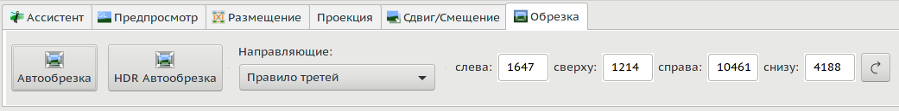

<small>[оригинал🗗](https://wiki.panotools.org/Hugin_Crop_tab)</small>

Используйте вкладку «**Обрезка**», чтобы указать область панорамы, которая должна использоваться в качестве выходного изображения. Эта обрезка работает не для отдельных изображений, а для всей панорамы.

Кнопки «Автообрезка» и «HDR Автообрезка» отрегулируют прямоугольник кадрирования так, чтобы он полностью находился в пределах области изображения, то есть не будет «черных» границ в конечном сшитом изображении (другими словами: он определяет максимальное количество пикселей без пустого черного пространства). Это достигается путем максимизации именно площади прямоугольника, а не ширины или высоты. Автоматически выполняется при запуске [[«Ассистента»|Вкладка «Ассистент»]] *(автообрезка выполняется по завершению шага «Выровнять» в «Ассистенте», дальнейшие действия в других вкладках, особенно выбор перспективы и смещения, естественно, ее пригодность сбивают, затем и эти кнопки — прим. перев.)*.

Чтобы изменить обрезку с каждого края, перемещайте мышь к этому краю, пока вдоль него не появится полупрозрачный белый прямоугольник; затем перетаскивайте его левой кнопкой мыши, пока край не окажется там, где вы хотите. Область снаружи перетаскиваемого прямоугольника представляет области, которые будут обрезаны вне панорамы. Вы можете переместить два края одновременно, перемещая мышь к углу, совместно используемому краями, пока не появятся оба белых прямоугольника. Если вы хотите переместить всю область сразу, переместите мышь в середину, чтобы вдоль всех четырех ребер были прямоугольники, и перетащите.

На этой вкладке также есть возможность отобразить направляющие в предварительном просмотре, чтобы помочь вам обрезать панораму.

Примечание: **кадрирование панорамы** не следует путать с [[коэффициентом кадрирования (кроп-фактором)|Кроп-фактор]] камеры, который представляет собой нечто совершенно другое.

Примечание 2: Эта вкладка не предназначена для обрезки отдельных изображений, таких как фотографии на циркулярный фишай с черными областями по краям, или отсканированные изображения с ненужными полями.

