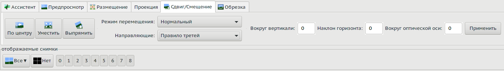

<small>[оригинал🗗](https://wiki.panotools.org/Hugin_move_drag_tab)</small>

С помощью этого инструмента вы можете изменять панораму в интерактивном режиме. Попробуйте следующее:

* Перетащите панораму левой кнопкой мыши, чтобы повернуть изображения панорамы. Центр вращения — это точка, в которой вы нажали кнопку мыши.
* Удерживайте `[Shift]` при выполнении вышеупомянутого, чтобы изменять смещение вокруг вертикали и наклон горизонта по отдельности. Обратите внимание, что на наклон влияет центр вращения.
* Перетащите панораму правой кнопкой мыши или левой с `[Ctrl]`, чтобы вращать панораму вокруг центра.

Если панорама содержит неподключенные компоненты (т.е. не связанные [[контрольными точками|Контрольные точки]]), они будут перемещаться по отдельности. Существует также **настраиваемый** режим перетаскивания (см. ниже).

## Режим перетаскивания

Этот выбор определяет, какие параметры изменяются при перетаскивании изображений.

* **Нормальный:** при перетаскивании влево-вправо изменяется угол вокруг вертикали, а при перетаскивании вверх-вниз — наклон горизонта (т.е. камера поворачивается по углам рысканья и тангажа).
* **Нормальный, настраиваемый:** добавляет флажки к кнопкам **отображаемых кадров**; здесь вы можете выбрать, какие изображения перетаскивать, по отдельности или вместе. При выборе этого режима соединения контрольных точек между фотографиями игнорируются.

В настраиваемом режиме вы можете выбрать галочками изображения для перетаскивания. Вы также можете добавить изображения в группу, нажав на изображение на панораме, одновременно нажимая клавишу `[Ctrl]`. При нажатии на изображение с клавишами `[Ctrl]` и `[Shift]` изображение удаляется из группы.

В экспертном режиме также можно изменить [[параметры преобразования X и Y|Сшивание фото-мозаики]] перетаскиванием.

* **Мозаика:** при перетаскивании влево-вправо изменяется параметр X, а при перетаскивании вверх-вниз изменяется параметр Y (т.е. камера перемещается в измерениях X и Y).
* **Мозаика, настраиваемая:** то же самое, но с возможностью выбора отдельных кадров.

##  По центру

Эта кнопка горизонтально выравнивает выходные данные, изменяя [[отклонение|Рысканье]] собранных изображений, чтобы они соответствовали центру выходного кадра. Это полезно, если слева или справа от выходных данных много черного пространства. Она также выполняет подгонку, эквивалентную следующей кнопке.

Обратите внимание, что центрирование панорамы в проекциях «[[Прямолинейная|Прямолинейная проекция]]» или «[[Рыбий глаз|Фишай-проекция]]» изменит перспективу что может быть нежелательным.

##  Уместить

Эта кнопка не меняет никаких параметров входного изображения; она просто перенастраивает отображаемое [[поле зрения|Поле зрения]] так, чтобы все входные изображения были видны. Если все изображения смещены от центра, будет много черного пространства.

##  Выпрямить

Выпрямление панорамы оптимизирует [[крен|Крен]] и [[тангаж|Тангаж]] входных изображений без изменения их относительного положения, выравнивая панораму в процессе. Это обычно дает хорошие результаты; если вам нужно более точное позиционирование, попробуйте добавить [[вертикальные контрольные точки|Вертикальные контрольные точки]] на [[соответствующей вкладке редактора|Вкладка «Контрольные точки»]] и повторить оптимизацию.

