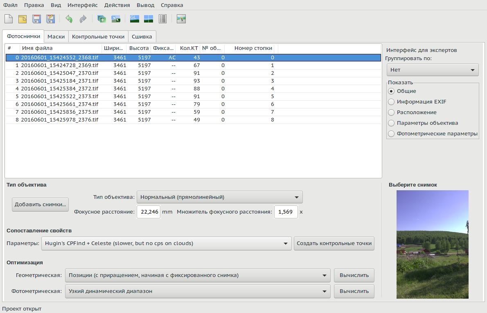
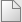
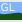

<small>[оригинал🗗](https://wiki.panotools.org/Hugin_Photos_tab)</small>

Вкладка «Фотоснимки» используется для:

* Управления изображениями в проекте Hugin;
* Управления положением изображений в окончательной панораме;
* Изменения настроек объектива;
* Изменения настроек фотометрии;
* Изменения/создания стопок кадров.

Множественный выбор можно использовать для изменения параметров нескольких изображений одновременно.

## Макет и использование

### Простейшая форма использования

Вкладка «Фотоснимки» — это вкладка с множеством опций и возможностей, которые будут объяснены на этой странице. Тем временем самое простое использование этой вкладки таково:

* Нажмите кнопку верхней панели  «**Новый проект**».
* Нажмите кнопку «**Добавить снимки...**», чтобы добавить изображения в ваш (новый) проект.
* Нажмите кнопку «**Создать контрольные точки**» в разделе «[[Сопоставление свойств|Вкладка «Фотоснимки»#feature-matching]]», чтобы начать обнаружение пар одинаковых точек на перекрывающихся изображениях.
* Нажмите кнопку «Вычислить» после выбора способа **геометрической оптимизации** (см. [[раздел «Оптимизация»|Вкладка «Фотоснимки»#optimise]]). По умолчанию используется способ «Позиции (с приращением, начиная с фиксированного снимка)».
* Нажмите кнопку «Вычислить» после выбора способа **фотометрической оптимизации**. По умолчанию используется «Узкий динамический диапазон».

Это самое простое использование этой вкладки. Следующим шагом будет улучшение «сцены» путем центрирования, подгонки, выпрямления и т.д., например, на [[вкладке «Сдвиг/Смещение»|Вкладка «Сдвиг/Смещение»]] в  «**Окне быстрого просмотра**», которое является [[главным окном Hugin|Главное окно]] в режиме простого пользовательского интерфейса.

### Режимы пользовательского интерфейса

Режимы пользовательского интерфейса: **Простой**, **Расширенный** и **Экспертный** — определяют макет и параметры (их количество) на этой вкладке.

Переключатели «**Показать**» с правой стороны определяют расположение и состав данных, отображаемых в таблице снимков. Конкретные количество и тип столбцов для каждой *опции отображения* снова зависят от режима интерфейса пользователя. Например, при выборе опции «**Общие**» колонка «*Номер стопки*» отображается только в **расширенном** и **экспертном** режимах.

