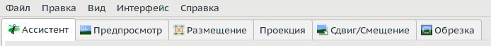
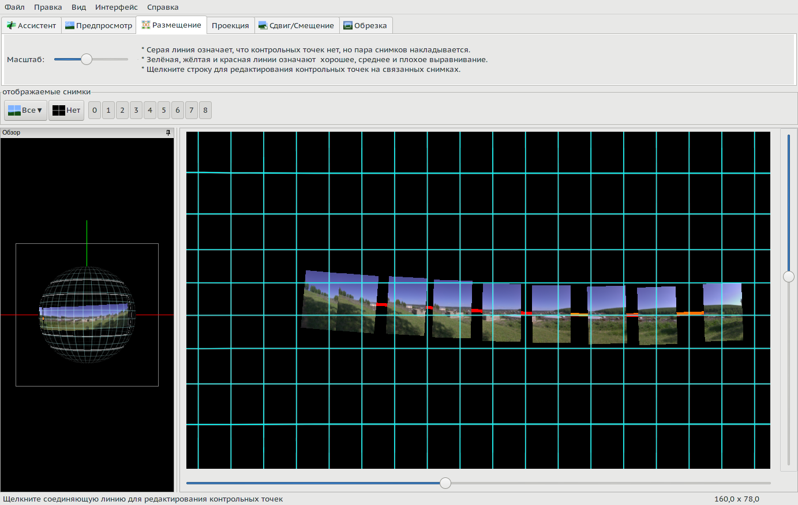

<small>[оригинал🗗](https://wiki.panotools.org/Hugin_Main_window)</small>

## Вкладки

Хотя существует множество других применений, Hugin — это прежде всего инструмент для сборки нескольких фотографий и создания «бесшовной» панорамы.

Hugin — это программа, основанная на «вкладках». Ниже вы видите фрагмент экрана Hugin, показывающий вкладки.

Этот процесс сборки нескольких фотографий и создания «бесшовной» панорамы является полностью автоматическим, если вы используете [[вкладку «Ассистент»|Вкладка «Ассистент»]], которая является вкладкой по умолчанию, но **Hugin** также позволяет полностью вручную управлять каждым этапом. Для этого Hugin предоставляет три варианта пользовательского интерфейса: простой, продвинутый и экспертный. Простой режим Hugin состоит из вкладки «Ассистент» и нескольких других вкладок (как показано выше), которые дают вам простой, но эффективный контроль над тем, что вы делаете.

Это краткий обзор *системы вкладок* для *простого* интерфейса. Это не пошаговое руководство. Руководства вы можете найти на [сайте Hugin🗗](http://hugin.sourceforge.net/tutorials/).

Аналогичный обзор «старого» пользовательского интерфейса, вы можете найти в «[Hugin Main window old GUI🗗](https://wiki.panotools.org/Hugin_Main_window_old_gui)».

### Ассистент

[[Вкладка «Ассистент»]] является полностью автоматической частью Hugin; здесь вы можете загружать изображения, выравнивать их и *сшивать* их в панораму, не используя другие вкладки. Вкладка также содержит окна обзора панорамы и предварительного просмотра. Этот обзор и предварительный просмотр видны и на других вкладках, с несколько другой функциональностью и иногда немного измененным макетом.

Кроме того, вы можете использовать данную вкладку в качестве первого шага при создании проекта, используя в дальнейшем некоторые или все другие вкладки. Вы также можете переключиться на один из других режимов пользовательского интерфейса, продвинутый или экспертный, если хотите или нуждаетесь в этом.

### Предпросмотр

На [[вкладке «Предпросмотр»|Вкладка «Предпросмотр»]] вы можете проверить свои изображения и их позиции, баланс белого, контрольные точки (одинаковые точки на двух перекрывающихся изображениях) *и так далее*. Изменения будут немедленно отображены в этом предварительном просмотре. Эта вкладка предоставляет те же окна предварительного просмотра, что и [[вкладка «Ассистент»|Вкладка «Ассистент»]], и все остальные вкладки в простом пользовательском интерфейсе.

### <a name="layout">Размещение</a>

Вкладка «Размещение» показывает весь проект в виде диаграммы с цветными линиями, соединяющими все фотографии.

Зеленые линии, соединяющие изображения, показывают, что контрольные точки имеют небольшую ошибку; красные линии показывают большую ошибку. Серые линии показывают отсутствие контрольных точек, соединяющих изображения.

Вы можете увидеть, где всё в порядке и где есть проблемы, если что-то пошло не совсем правильно. Просто нажмите на любое соединение, и Hugin откроет [[редактор контрольных точек|Вкладка «Контрольные точки»]].

Используйте ползунки снизу и справа от области просмотра, чтобы изменить размер миниатюр фотографий. Это влияет только на отображение макета и не меняет окончательную панораму.

### Проекция

[[Вкладка «Проекция»]] предназначена для настройки [[проекции|Projections]] панорамы; некоторые проекции имеют настраиваемые параметры, которые будут отображаться при выборе.

### Сдвиг/Смещение

[[Вкладка «Сдвиг/Смещение»]] используется для интерактивного сдвига центра панорамы (или размещения по какой-либо причине вне центра).

### Обрезка

[[Вкладка «Обрезка»]] отображает прямоугольник поверх вашего предварительного просмотра. Перетаскивая края этого прямоугольника, вы можете настроить область вывода панорамы.

## Меню

### Файл

* «**Новый**» — отменить текущий проект и начать новый.
* «**Открыть...**» существующий файл проекта [[Hugin]], [[PTGUI]], [[PTAssembler]], [[autopano]] или [[autopano-sift]].
* «**Сохранить**» текущий проект как `.pto`-файл.
* «**Save as...**» — сохранить текущий проект с выбором имени файла.
* «**Most recently used projects**» — показывает список последних проектов Hugin.
* «**Запустить обработчик задач**» — запускает графический интерфейс менеджера очередей [[Hugin Batch Processor]]; обратите внимание, что очередь не будет обработана, если не запущен этот администратор очередей.
* «**Preferences**» — открывает окно [[настроек Hugin|Настройки Hugin]].
* «**Выход**» из Hugin.

### Правка

* «**Отменить**» — отменяет самое последнее изменение в текущем проекте.
* «**Повторить**» повторяет отмененное.
* «**Оптимизировать**» — *отсутствует в оригинале, но есть по факту (прим. перев.)*.

### Вид

* «**Редактор панорамы**» открывает [[окно редактора|Редактор панорамы]], где вы можете контролировать различные состояния, через которые проходит рабочий процесс от набора исходных изображений до финальной панорамы.
* «**Full Screen**» открывает главное окно Hugin на полный экран. Обратите внимание, что [[окно быстрого просмотра]] также можно открыть в полноэкранном режиме.
* Флажок «**Обзор**»: показывает или скрывает окно обзора (закрепленное).
* Флажок «**Grid**»: показывает или скрывает сетку в окне обзора и предварительного просмотра (см. [[вкладку «Ассистент»|Вкладка «Ассистент»]]).

### Интерфейс

* «**Simple**»: интерфейс предлагает всю базовую функциональность для создания панорам и будет достаточен в 90% случаев.
* «**Advanced**»: в этом режиме стартовым окном становится «[[Редактор панорамы]]», окно простого интерфейса остается на заднем плане.
* «**Expert**»: в дополнение к предыдущему показывает все опции и возможности тонкой настройки, доступные в Hugin.

### Справка

* «**Справка**» открывает руководство Hugin.
* «**Совет дня**»
* «**Горячие клавиши**»
* «**FAQ**»: [[Часто задаваемые вопросы по Hugin|Hugin FAQ]].
* «**О программе**» показывает соответствующее окно.

