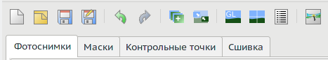
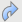
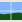
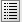
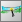

<small>[оригинал🗗](https://wiki.panotools.org/Hugin_Panorama_Editor_window)</small>

## Вкладки

Окно редактора панорамы также основано на вкладках. Ниже вы видите частичный скриншот, на котором показаны вкладки с панелью кнопок над ними.

### Фотоснимки

[[Вкладка «Фотоснимки»]] используется для:

* Управления изображениями в проекте Hugin;
* Управления положением изображений в окончательной панораме;
* Изменения настроек объектива;
* Изменения настроек фотометрии;
* Изменения/создания стопок кадров.

### Маски

Часто фотографии содержат детали, которые не должны попасть в окончательную панораму (например, движущиеся объекты); или же наоборот — вам может понадобиться специально включить в нее какие-то моменты (например, людей).

[[Вкладка «Маски»]] позволяет маскировать эти области для включения или исключения из сшитой панорамы.

### Контрольные точки

[[Hugin]] сшивает панорамы, сопоставляя одинаковые особенности на разных перекрывающихся фотографиях. Эти особенности определяются *парами* [[контрольных точек|Контрольные точки]]. [[Вкладка «Контрольные точки»]] показывает две фотографии одновременно и позволяет вручную создавать и редактировать любую пару контрольных точек.

В дополнение к вкладке «Контрольные точки», [[таблица контрольных точек|Таблица контрольных точек]] используется для управления парами контрольных точек.

Контрольные точки можно создавать автоматически по кнопке «**Выровнять**» на [[вкладке «Ассистент»|Вкладка «Ассистент»]] или в разделе «**Сопоставление свойств**» на [[вкладке «Фотоснимки»|Вкладка «Фотоснимки»]].

### Оптимизация

Если вы посмотрите на скриншот сверху, вы не увидите [[вкладку «Оптимизация»|Вкладка «Оптимизация»]]. Это связано с тем, что она отображается только при выборе ручных параметров для геометрической оптимизации на [[вкладке «Фотоснимки»|Вкладка «Фотоснимки»]].

### Экспозиция

Если вы посмотрите на экран частичного отображения вкладок, вы не увидите [[вкладку «Экспозиция»|Вкладка «Экспозиция»]]. Это связано с тем, что она отображается только при выборе ручных параметров для фотометрической оптимизации на [[вкладке «Фотоснимки»|Вкладка «Фотоснимки»]].

### Сшивка

Конечным результатом проекта Hugin является файл изображения, содержащий панораму. На последней [[вкладке «Сшивка»|Вкладка «Сшивка»]] задаются размер и качество и создается этот выходной файл.

## Меню

### Файл

* «**Новый**» — отменить текущий проект и начать новый пустой проект.
* «**Открыть...**» существующий файл проекта [[Hugin]], [[PTGUI]], [[PTAssembler]], [[autopano]] или [[autopano-sift]].
* «**Сохранить**» текущий проект как `.pto`-файл Hugin.
* «**Save as...**» — сохранить как `.pto`-файл с выбором имени.
* «**Write PTStitcher script...**» — сохраняет упрощенный файл проекта, подходящий для пакетного сшивания с помощью [[PTStitcher]], [[nona]] или [[PTmender]]. Обратите внимание, что [[nona]] может напрямую сшить файл проекта [[Hugin]], поэтому этот шаг не нужен при использовании **nona**.
* «**Most recently used projects**» — показывает список последних проектов Hugin.
* «**Запустить обработчик задач**» — запускает графический интерфейс менеджера очередей [[Hugin Batch Processor]]; обратите внимание, что очередь не будет обработана, если не запущен этот администратор очередей.
* «**Добавить проект...**» можно использовать для объединения текущего проекта с другим. Новые фотографии будут добавлены в список изображений; для дубликатов фотографий объединяются только контрольные точки.
* «**Apply Template...**» назначает параметры из существующего `.pto`-проекта для текущего набора фотографий. Передаются только параметры положения и объектива; контрольные точки игнорируются.
* «**Preferences**» — открывает окно [[настроек Hugin|Настройки Hugin]].
* «**Выход**» из Hugin.

### Правка

* «**Отменить**» — отменяет самое последнее изменение в текущем проекте.
* «**Повторить**» повторяет отмененное.
* «**Add Image...**» — добавить изображение в текущий проект.
* «**Import Raw Image...**» преобразует необработанные изображения в формат TIFF и добавляет их в текущий проект (см. [[импорт RAW|Импорт RAW]] для более подробной информации) *(в современной версии этого пункта нет, RAW можно добавить так же, как и другие форматы, через предыдущий пункт — прим. перев.).*
* «**Запустить ассистента**» запустит автоматическое создание панорамы, найдя контрольные точки, выровняв и оптимизировав.
* *Подменю «**User defined assistant**» — вероятно, появилось в новых версиях — в оригинале документации описание отсутствует (прим. перев.).*
* «**Отправить в очередь ассистента**» запустит автоматическое создание панорам через пакетный процессор, если вы хотите создать несколько панорам друг за другом.
* *Флажки «**Оптимизировать только активные снимки**» и «**Ignore line control points**» в оригинале отсутствуют (прим. перев.).*
* «**Оптимизировать**» повторно оптимизирует текущий проект. Производит тот же эффект, что и нажатие кнопки «**Вновь оптимизировать!**» на [[вкладке «Оптимизация»|Вкладка «Оптимизация»]].
* «**Точно скорректировать все точки**» выполняется так же, как и «**Автоматическая точная коррекция**» на [[вкладке «Контрольные точки»|Вкладка «Контрольные точки»]], за исключением того, что применяется ко всем [[контрольным точкам|Контрольные точки]] в проекте. Точные настройки настраиваются в [[настройках Hugin|Настройки Hugin]].
* «**Remove control points in masks**» удаляет все контрольные точки в регионах, которые маскируются на [[вкладке «Маски»|Вкладка «Маски»]].
* «**Run Python script...**» запустит один из установленных или самостоятельно созданных скриптов Python. Эта опция доступна только тогда, когда ваша сборка **Hugin** скомпилирована с поддержкой Python.

### Вид

* «**Full Screen**» разворачивает данное окно на полный экран без заголовка и декораций окна. Обратите внимание, что также на полный экран может быть развернуто [[окно быстрого просмотра|Окно быстрого просмотра]] *(не очень понятно, где такое окно существует, помимо документации — прим. перев.)*.
* «**Control point table**» открывает [[таблицу контрольных точек|Таблица контрольных точек]].
* «**Panorama preview window**» открывает [[окно предпросмотра|Окно предпросмотра]].
* «**Fast panorama preview window**» — переход к [[предпросмотру|Вкладка «Ассистент»#preview]] в [[главном окне|Главное окно]].
* «**Photos**» — переход на [[владку «Фотоснимки»|Вкладка «Фотоснимки»]].
* «**Masks**» — переход на [[вкладку «Маски»|Вкладка «Маски»]].
* «**Control Points**» — переход на [[вкладку «Контрольные точки»|Вкладка «Контрольные точки»]].
* «**Optimizer**» — переход на [[вкладку «Оптимизация»|Вкладка «Оптимизация»]].
* «**Exposure**» — переход на [[вкладку «Экспозиция»|Вкладка «Экспозиция»]].
* «**Stitcher**» — переход на [[вкладку «Сшивка»|Вкладка «Сшивка»]].

### Действия

В этом меню находится список плагинов, написанных на языке Python. Меню доступно, только если Hugin скомпилирован с поддержкой Python.

### Интерфейс

* «**Simple**»: интерфейс предлагает всю базовую функциональность для создания панорам и будет достаточен в 90% случаев.
* «**Advanced**»: в этом режиме стартовым окном становится «[[Редактор панорамы]]», окно простого интерфейса остается на заднем плане.
* «**Expert**»: в дополнение к предыдущему показывает все опции и возможности тонкой настройки, доступные в Hugin.

### Вывод 

*(Данное подменю в оригинале не описано, вероятно, появилось в поздних версиях — прим. перев.)*

### Справка

* «**Справка**» открывает руководство Hugin.
* «**Совет дня**»
* «**Горячие клавиши**»
* «**FAQ**»: [[Часто задаваемые вопросы по Hugin|Hugin FAQ]].
* «**О программе**» показывает соответствующее окно.

## Кнопки

Над рядом вкладок находится ряд кнопок для основных команд:

###  Новый проект

Отменяет текущий проект и начинает новый пустой проект.

###  Открыть проект

Открывает существующий файл проекта [[Hugin]], [[PTGUI]], [[PTAssembler]], [[autopano]] или [[autopano-sift]].

###  Сохранить проект

Сохраняет текущий проект в виде `.pto`-файла.

###  Save project as...

Сохраняет как файл `.pto` с другим именем.

###  Отменить

Отменяет самое последнее изменение текущего проекта.

###  Повторить

Повторяет отмененное изменение.

###  Добавить изображение

Добавляет изображение в текущий проект.

###  Заново оптимизировать

Повторно оптимизирует текущий проект. Это имеет тот же эффект, что и нажатие кнопки «**Вновь оптимизировать!**» на [[вкладке «Оптимизация»|Вкладка «Оптимизация»]].

###  Быстрый предпросмотр

Открывает предпросмотр в [[главном окне|Главное окно]].

###  Просмотреть панораму

Открывает [[окно предпросмотра|Окно предпросмотра]].

###  Показать контрольные точки

Открывает [[окно со списком контрольных точек|Таблица контрольных точек]].

###  О Hugin

Открывает окно «О программе». В нем отображается текущая версия и список участников.

